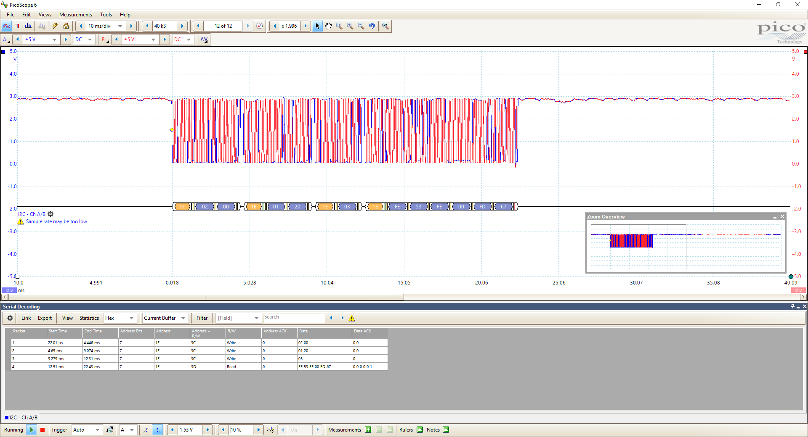

# Azure Sphere Bit Bang I2C

An example of writing and reading to an I2C device (HMC5883 Digital compass) using an Azure Sphere

We needed to port this software protocol (bitbang) as the hardware version was not yet available.



## Usage

For the full details of use see main.c

Create a structure to hold the file handles and define the pins used,

```c
static i2cbus_t i2cbus1 = {
    .sclFd = -1,
    .scl = MT3620_RDB_HEADER2_PIN13_GPIO,
    .sdaFd = -1,
    .sda = MT3620_RDB_HEADER2_PIN11_GPIO
};
```

Setup the bus

```c
i2c_bb_setup(&i2cbus1);
```

Writing a value "0" a register HMC5883_REGISTER_MAG_MR_REG_M using i2c_bb_tx

```c
const unsigned char msgEnable[2] = { HMC5883_REGISTER_MAG_MR_REG_M, 0x00 }; // Enable Magnetometer, Continuous mode, Low Speed I2C 
i2c_bb_tx(&i2cbus1, HMC5883_ADDRESS_MAG, &msgEnable[0], 2);
```

Reading 6 bytes from a register HMC5883_REGISTER_MAG_OUT_X_H_M using i2c_bb_rx
```c
const unsigned char msgSelectMagRegister[1] = { HMC5883_REGISTER_MAG_OUT_X_H_M }; // Get mag reading

unsigned char rec[6];
short ret;

//Write register to read
i2c_bb_tx(&i2cbus1, HMC5883_ADDRESS_MAG, &msgSelectMagRegister[0], 1);

//Read 6 bytes
ret = i2c_bb_rx(&i2cbus1, HMC5883_ADDRESS_MAG, &rec[0], 6);
```


 

